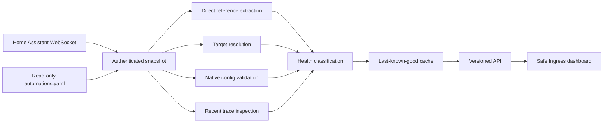

# Automation Inspector

Automation Inspector is a read-only **Home Assistant App** that audits every loaded automation and, when available, every UI-managed automation in `automations.yaml`.

It resolves modern Home Assistant targets, checks dependency health, validates automation syntax, identifies Home Assistant 2026.7 migrations, and surfaces recent trace failures. All analysis runs locally inside Home Assistant; there is no telemetry or external data service.

> [!IMPORTANT]
> Version 1.0.0 is a breaking upgrade. It requires Home Assistant 2026.7.0 or newer, removes unauthenticated host-port access, and drops `armv7`. See [Migrating from 0.4.x](#migrating-from-04x).

## Highlights

- **Complete automation config** — reads each loaded automation through the canonical `automation/config` WebSocket API instead of relying on state attributes.
- **Current target model** — understands entity, device, area, floor, and label targets.
- **Purpose-aware resolution** — filters resolved entities using the trigger, condition, or action target metadata Home Assistant itself publishes.
- **Missing references remain visible** — reports missing, disabled, unavailable, and unknown entities instead of silently discarding them.
- **Unloaded automation detection** — safely scans read-only `automations.yaml` so invalid UI-managed automations do not disappear from the report.
- **Native validation** — sends triggers, conditions, and actions through Home Assistant's `validate_config` command.
- **2026.7 migration checks** — identifies removed trigger/condition names and deprecated target behavior values with replacements.
- **Trace diagnostics** — reports the latest stored execution failure and template errors.
- **Resilient snapshots** — coalesces concurrent refreshes and preserves last-known-good data if Home Assistant is temporarily unavailable.
- **Safe dashboard** — uses DOM construction rather than HTML injection, a nonce-based Content Security Policy, no external scripts, responsive layouts, and accessible controls.
- **Ingress-only by default** — the App manifest no longer publishes port 1234 to the local network.

## Installation

1. In Home Assistant, open **Settings → Apps → App store**.
2. Open the repository menu and add:

   ```text
   https://github.com/ITSpecialist111/Automation-Inspector
   ```

3. Reload the store and install **Automation Inspector**.
4. Start the App and select **Open Web UI**.

The sidebar entry is admin-only because automation definitions and entity states can contain sensitive information.

### Supported platforms

| Requirement | Supported |
|---|---|
| Home Assistant | 2026.7.0 or newer |
| Architectures | `amd64`, `aarch64` |
| Access | Authenticated Home Assistant Ingress |
| Installation | Home Assistant OS or a supervised installation with Apps |

## Configuration

| Option | Default | Range | Purpose |
|---|---:|---:|---|
| `refresh_interval` | 300 seconds | 30–86400 | Background report refresh cadence |
| `request_timeout` | 15 seconds | 3–120 | Timeout for each WebSocket response |
| `include_disabled` | `true` | Boolean | Include automations that are turned off |
| `inspect_traces` | `true` | Boolean | Fetch details for recent failed traces |
| `scan_automations_file` | `true` | Boolean | Find UI-managed automations that failed to load |

Changes take effect after restarting the App.

## Home Assistant 2026.7 checks

Version 1.0 recognizes these removed names and suggests the current equivalent:

| Removed in 2026.7 | Replacement |
|---|---|
| `battery.low` | `battery.became_low` |
| `battery.not_low` | `battery.no_longer_low` |
| `lawn_mower.docked` | `lawn_mower.returned_to_dock` |
| `schedule.turned_off` | `schedule.block_ended` |
| `schedule.turned_on` | `schedule.block_started` |
| `timer.time_remaining` | `timer.remaining_time_reached` |
| `update.update_became_available` | `update.became_available` |
| `vacuum.docked` | `vacuum.returned_to_dock` |
| `climate.target_humidity` | `climate.is_target_humidity` |
| `climate.target_temperature` | `climate.is_target_temperature` |

It also flags deprecated target `options.behavior` values (`any` → `each`, `last` → `all`) and informational migrations from singular top-level keys to `triggers`, `conditions`, and `actions`.

## How it works



One authenticated WebSocket connection batches:

- states and Home Assistant metadata;
- entity, device, area, floor, and label registries;
- entity integration sources and service descriptions;
- loaded automation configurations;
- trigger and condition platform descriptions;
- target extraction and config validation requests;
- trace summaries and failed trace details.

`automations.yaml` is mounted at `/homeassistant` read-only. It is parsed with a `SafeLoader` subclass that treats Home Assistant tags such as `!secret` as inert values; secrets are not resolved or returned.

## Report semantics

An automation needs attention when one or more of these conditions apply:

- an entity reference is missing, unavailable, unknown, or disabled;
- a device, area, floor, or label target no longer exists;
- Home Assistant rejects a trigger, condition, or action section;
- a 2026.7 removed/deprecated construct is present;
- the latest stored run failed or contains template errors;
- an entry exists in `automations.yaml` but did not load.

“Unreferenced helpers” are cleanup candidates, not deletion instructions. A helper can still be used by scripts, dashboards, templates, integrations, or external clients.

## HTTP API

All report endpoints are intended to be reached through authenticated Ingress.

| Endpoint | Purpose |
|---|---|
| `GET /health` | Process liveness for the Supervisor watchdog |
| `GET /ready` | Report readiness and cache status; returns 503 before the first successful snapshot |
| `GET /api/v1/status` | Cache age, generation, refresh interval, and last error |
| `GET /api/v1/inspection` | Schema version 2 report; supports ETags |
| `GET /api/v1/inspection?refresh=true` | Coalesced manual refresh |
| `GET /dependency_map.json` | Compatibility alias for the report endpoint |

If a refresh fails after a successful run, the report remains available with the `X-Automation-Inspector-Stale: true` response header.

## Privacy and security

- No telemetry, analytics, CDN, remote font, or third-party JavaScript.
- No Home Assistant write/service commands are issued.
- Home Assistant configuration is mounted read-only.
- The production container runs as an unprivileged user with `/tmp` on `tmpfs`.
- Direct host-port publication was removed; access is through authenticated, admin-only Ingress.
- The frontend uses a strict CSP with a per-response nonce and does not use `innerHTML`.
- API responses use ETags, `nosniff`, a restrictive permissions policy, and no wildcard CORS.

See [SECURITY.md](SECURITY.md) for vulnerability reporting.

## Local development

Python 3.12 or newer and Node.js are sufficient for local checks. The production image uses Python 3.14.

```bash
python -m venv .venv
source .venv/bin/activate              # Windows: .venv\Scripts\activate
python -m pip install -r requirements-dev.txt
python -m pytest --cov
python -m ruff check .
python -m mypy
node --check automation_inspector/www/app.js
```

To connect the local server to Home Assistant, use an administrator long-lived access token:

```bash
export HA_WS_URL="ws://homeassistant.local:8123/api/websocket"
export HA_TOKEN="<administrator-token>"
python -m uvicorn app.main:app --app-dir automation_inspector --port 1234
```

Do not expose that development server to an untrusted network. It does not add a second authentication layer because production access is deliberately delegated to Home Assistant Ingress.

### Container build

```bash
docker build \
  --build-arg BUILD_ARCH=amd64 \
  --build-arg BUILD_VERSION=1.0.0 \
  -t automation-inspector:dev \
  automation_inspector
```

Published releases use the maintained Home Assistant builder actions to create signed `amd64` and `aarch64` images plus a generic multi-architecture manifest in GHCR.

## Project layout

```text
automation_inspector/
├── app/
│   ├── automation_file.py   # Safe unloaded-automation scan
│   ├── compatibility.py     # 2026.7 and syntax migrations
│   ├── dependency_map.py    # Analysis and schema-2 report builder
│   ├── ha_client.py         # Batched authenticated WebSocket client
│   ├── main.py              # FastAPI routes and security headers
│   ├── references.py        # Direct references and modern targets
│   ├── service.py           # Concurrent last-known-good cache
│   └── settings.py          # App options and development overrides
├── translations/en.yaml
├── www/                     # CSP-compatible dashboard
├── config.yaml              # Current Home Assistant App manifest
├── Dockerfile
└── requirements.txt
tests/                       # Unit, protocol, API, and security contracts
.github/workflows/           # CI and signed multi-arch publishing
```

## Migrating from 0.4.x

1. Upgrade Home Assistant to 2026.7 or newer.
2. Confirm the host is `amd64` or `aarch64`; `armv7` is no longer supported by current Home Assistant Apps.
3. Update Automation Inspector manually. `1.0.0` is marked as a breaking version, so auto-update will not cross it unattended.
4. Remove bookmarks to `http://<home-assistant>:1234`. Open the App through Home Assistant's sidebar or **Open Web UI** button.
5. Review the new configuration defaults and restart the App.
6. Treat newly reported unloaded automations, target issues, and 2026.7 migrations as actionable findings; the previous implementation could not see them.

The legacy `/dependency_map.json` URL remains available to ease custom-client migration, but consumers should move to `/api/v1/inspection` and check `schema_version`.

## Known limits

- Dynamically constructed entity IDs in templates cannot always be inferred statically.
- Blueprint analysis is limited to values present in the automation's stored blueprint inputs.
- The unloaded-automation scan covers the standard UI-managed `automations.yaml`; arbitrary included YAML files are represented only when Home Assistant successfully loads them.
- Recent trace diagnostics depend on Home Assistant retaining a trace for that automation.
- Helper usage is evaluated only against inspected automations.

## Contributing

See [CONTRIBUTING.md](CONTRIBUTING.md). The test suite currently covers settings, safe YAML parsing, 2026.7 migrations, reference extraction, target semantics, WebSocket protocol behavior, cache failure modes, API contracts, manifest security, and frontend injection guards.

## License

[MIT](LICENSE) © 2025–2026 Graham Hosking and contributors.